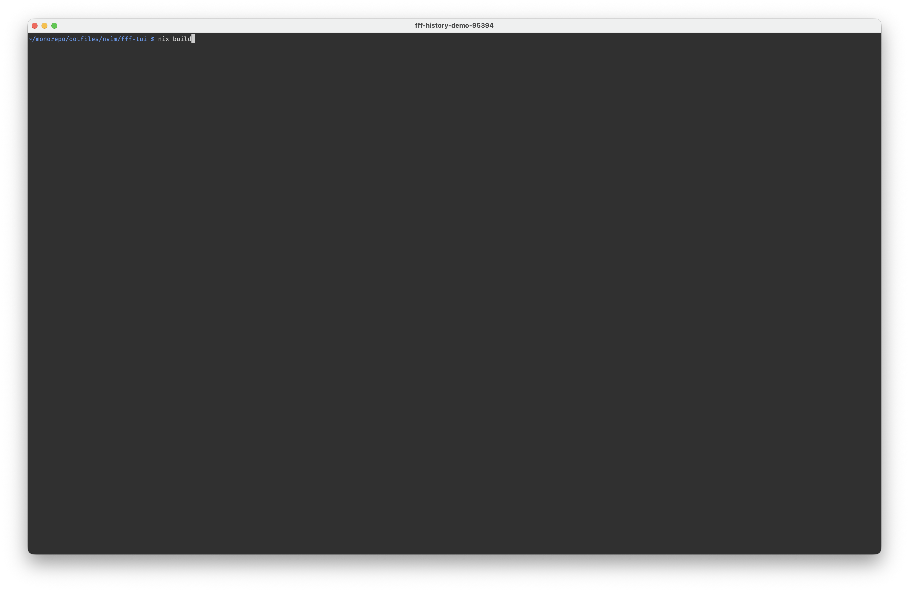

# fff

`fff` is a fast shell-oriented companion to [`fff.nvim`](https://github.com/dmtrKovalenko/fff.nvim).

Current modes:

- `fff files`: inline file picker
- `fff history`: inline shell history picker
- `fff ...`: grep-like CLI search by default

This repo is currently a standalone Rust CLI nested inside the dotfiles repo while it is being developed.

## Demo

History search selecting a prior `nix build ...` command:

[](demo/fff-history-demo-kitty.mp4)

## Build

### With Nix

```sh
nix develop -c cargo build --release
```

### Without Nix

```sh
cargo build --release
```

The resulting binary is:

```sh
./target/release/fff
```

If you want to use it from your shell globally, put it on `PATH`:

```sh
ln -sf "$PWD/target/release/fff" "$HOME/bin/fff"
```

## Usage

### Grep mode

Bare `fff` behaves like a basic `ag`/`rg` replacement.

```sh
fff "needle" .
fff -F "literal text" src
fff -C 2 "HistoryDirection" src/lib.rs
fff --fuzzy "cfilt" .
```

Supported flags today:

- `-F`, `--fixed-strings`
- `--fuzzy`
- `-C`, `-B`, `-A`
- `-m`, `--max-matches-per-file`
- `--page-limit`
- `--smart-case`

Notes:

- regex is the default mode
- output is grouped by file in a style closer to `ag`
- when stdout is a terminal, matches are highlighted
- this is still a basic replacement, not full `ag`/`rg` flag parity

### File picker

```sh
fff files
fff files --base-path ~/projects/melange
```

### History picker

```sh
fff history
FFF_HISTORY_QUERY="nix" fff history
FFF_HISTORY_DIRECTION=forward fff history
```

History mode will:

- read commands from stdin if provided
- otherwise fall back to `HISTFILE` or `~/.zsh_history`
- dedupe identical commands while preserving recency direction

## Zsh setup

If `fff` is on your `PATH`, this is enough to wire it into `Ctrl-T`, `Ctrl-R`, and `Ctrl-S`.

Add this to your `.zshrc`:

```zsh
[[ -o interactive ]] && stty -ixon 2>/dev/null || true

fff-file-widget() {
  local selected prefix=""

  selected=$(fff files) || {
    zle redisplay
    return 0
  }

  [[ -n "$selected" ]] || {
    zle redisplay
    return 0
  }

  if [[ -n "$LBUFFER" && "$LBUFFER[-1]" != ' ' ]]; then
    prefix=" "
  fi

  LBUFFER+="$prefix${(q-)selected}"
  zle redisplay
}

fff-history-widget() {
  local direction="$1" selected query
  local -A seen
  local key command

  setopt localoptions noposixbuiltins no_aliases noksharrays 2>/dev/null
  zmodload -F zsh/parameter p:history 2>/dev/null || {
    zle -M "fff history: failed to load zsh history parameter"
    return 1
  }

  query="$LBUFFER"
  selected="$(
    {
      if [[ "$direction" == "forward" ]]; then
        for key in ${(onk)history}; do
          command=${history[$key]}
          [[ -n ${seen[$command]-} ]] && continue
          seen[$command]=1
          print -rn -- "$command"$'\0'
        done
      else
        for key in ${(Onk)history}; do
          command=${history[$key]}
          [[ -n ${seen[$command]-} ]] && continue
          seen[$command]=1
          print -rn -- "$command"$'\0'
        done
      fi
    } | FFF_HISTORY_HEIGHT=12 FFF_HISTORY_QUERY="$query" fff history
  )" || {
    zle redisplay
    return 0
  }

  [[ -n "$selected" ]] || {
    zle redisplay
    return 0
  }

  BUFFER="$selected"
  CURSOR=${#BUFFER}
  zle reset-prompt
}

fff-history-backward-widget() {
  fff-history-widget backward
}

fff-history-forward-widget() {
  fff-history-widget forward
}

zle -N fff-file-widget
zle -N fff-history-backward-widget
zle -N fff-history-forward-widget

bindkey '^T' fff-file-widget
bindkey '^R' fff-history-backward-widget
bindkey '^S' fff-history-forward-widget
bindkey -M emacs '^T' fff-file-widget
bindkey -M emacs '^R' fff-history-backward-widget
bindkey -M emacs '^S' fff-history-forward-widget
bindkey -M vicmd '^R' fff-history-backward-widget
bindkey -M vicmd '^S' fff-history-forward-widget
bindkey -M viins '^T' fff-file-widget
bindkey -M viins '^R' fff-history-backward-widget
bindkey -M viins '^S' fff-history-forward-widget
```

## Development

Useful commands:

```sh
make build
make test
make fmt-check
make check
nix flake check
```

Release:

```sh
make release V=0.1.0
```

That script:

- updates the crate version
- commits the release
- tags it as `vX.Y.Z`
- pushes the branch and tag

GitHub Actions then builds release artifacts for the configured platforms.
